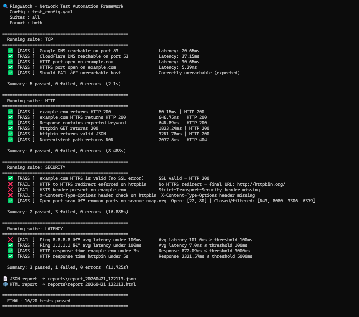

# 🔍 PingWatch — Network Test Automation Framework

A Python-based CLI tool that automatically tests network health across 4 suites — TCP connectivity, HTTP behaviour, security headers, and latency. Generates structured HTML and JSON reports after every run.

Built to demonstrate **network QA automation skills** relevant to SD-WAN and enterprise networking roles.

---

## 📸 Demo



---

## ⚡ Quick Start

```bash
# 1. Clone the repo
git clone https://github.com/Hemanathan1/pingwatch
cd pingwatch

# 2. Install dependencies
pip install -r requirements.txt

# 3. Run all tests
python runner.py

# 4. Run with CI/CD threshold (fail if pass rate below 90%)
python runner.py --threshold 90

# 5. Run a specific suite only
python runner.py --suite tcp http
```

---

## 🧪 Test Suites

| Suite | What it tests |
|---|---|
| TCP | Socket connectivity to host:port with timeout |
| HTTP | Status codes, body keywords, content-type |
| Security | SSL, HTTPS redirect, HSTS, port scanning |
| Latency | Ping latency + HTTP response time vs thresholds |

---

## 📊 Sample Results

---

## 🔧 Tech Stack

- Python 3.10+
- requests — HTTP client
- PyYAML — config parsing
- socket / subprocess — TCP and ping
- HTML report with dark theme dashboard

---

## 💡 Key Features

- ✅ Data-driven tests — add new tests in YAML, zero code changes
- ✅ 4 test suites — TCP, HTTP, Security, Latency
- ✅ CI/CD ready — --threshold flag exits with error code if pass rate drops
- ✅ HTML + JSON reports generated after every run
- ✅ Negative test cases supported via expect_fail flag

---

## 📁 Project Structure

pingwatch/
├── runner.py              # Main CLI entry point
├── test_config.yaml       # All test definitions
├── requirements.txt
├── core/
│   ├── tcp_tests.py
│   ├── http_tests.py
│   ├── security_tests.py
│   └── latency_tests.py
└── reports/
└── reporter.py

---

Made by [Hemanathan B](https://www.linkedin.com/in/hemanathan-b-962a9427b/)